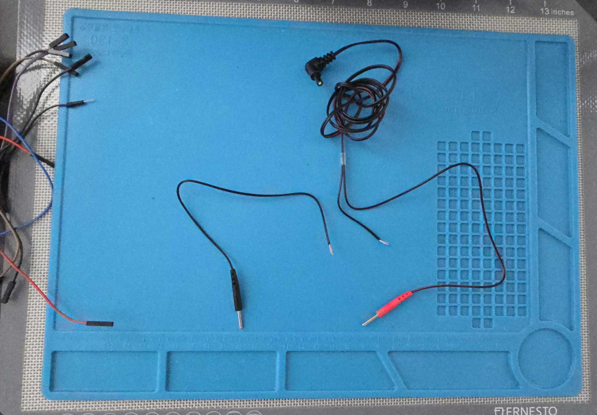
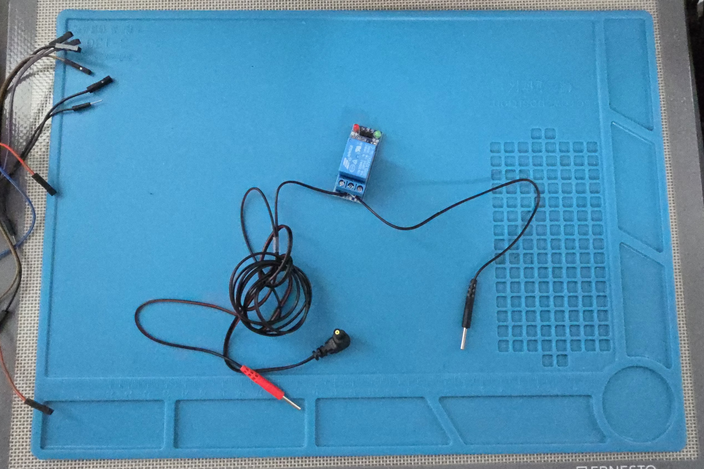
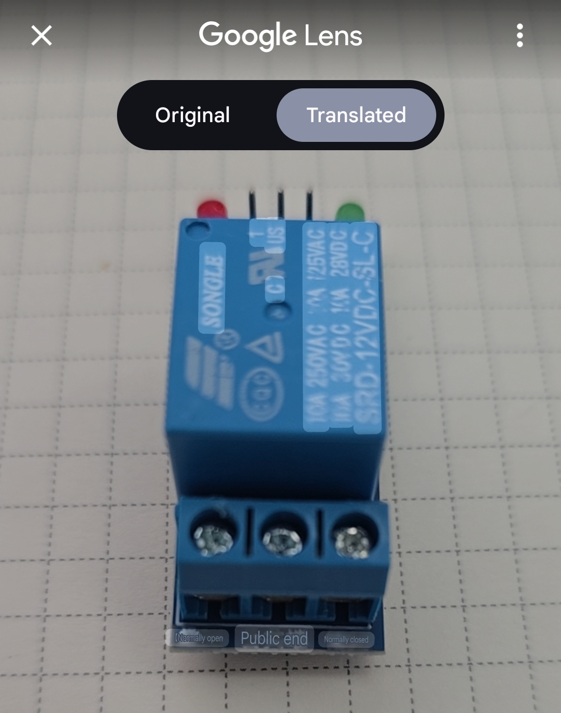
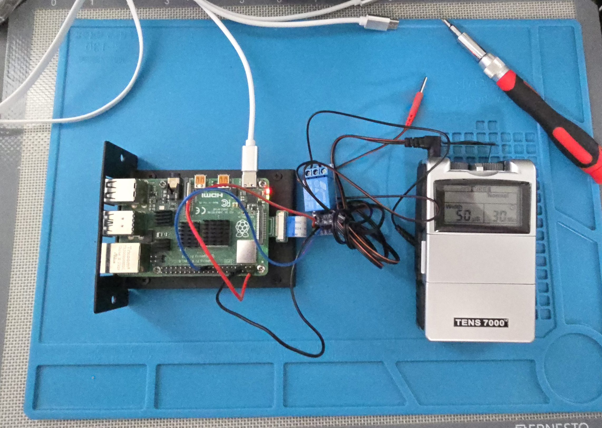

# Milgram Pi
## Use at your own risk.
Run Stanley Milgram's famous experiment with a Raspberry Pi and MCP.

## Bill of Materials
- Raspberry Pi
- TENS Unit
- Relay Module

## Getting Started
Flash the Raspberry Pi with the OS of your choice and enable SSH. Follow the pinout and wiring guide to connect the Raspberry Pi to the relay module and the TENS unit. After that run the following commands to install the required libraries and run the script.

```
git clone https://github.com/christopherwoodall/milgram-pi.git
cd milgram-pi
pip install -e .
milgram-pi
```

## Wiring Guide

Begin by slicing the black wire from a TENS unit connector about 4" from the end. Strip the ends of the wire to expose the copper.




Next, connect the black wire from the TENS unit connector to the plug labeled Common (COM) on the relay module. Connect the other end to the plug labeled Normally Open (NO).




Shoutout Google Lens (make sure to get the right relay).




Wire the VCC and GND pins to the Raspberry Pi's 5V and GND pins, respectively. Finally, connect the IN pin to GPIO 21 on the Raspberry Pi.




## Acknowledgements
Inspired by Tim Keeley's [shockbot](https://www.instructables.com/Shockbot/) project.


## Resources
- [Milgram Experiment](https://en.wikipedia.org/wiki/Milgram_experiment)
- [Adding Remote MCP Servers](https://support.anthropic.com/en/articles/11175166-getting-started-with-custom-integrations-using-remote-mcp)
